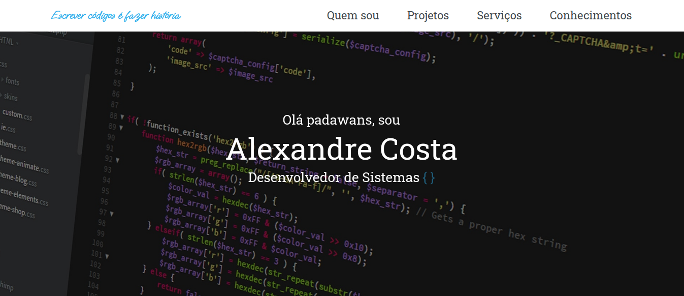
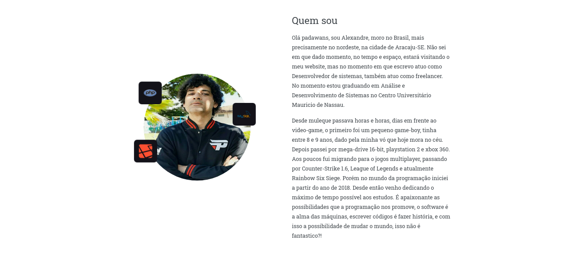
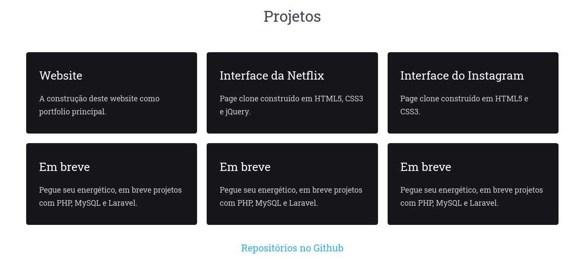
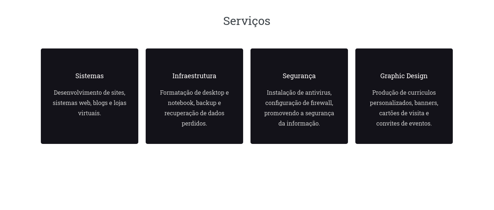
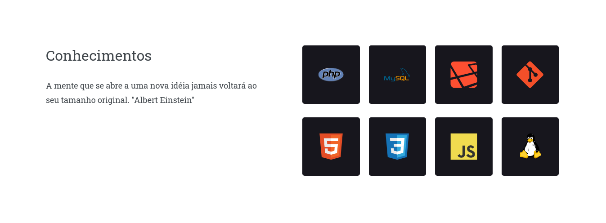

<h2 align="center">
  Escrever códigos é fazer história - Minha WebPage
</h2>

### Versão 1.0.0 - meu site online [https://allecosta.github.io/webpage/](https://allecosta.github.io/webpage/)

 

- **Home:** Home principal, com barra de menu e breve apresentação;

- **Quem sou:** Breve introdução de quem sou e do meu atual momento de vida;

 

- **Projetos:** Apresento alguns projetos desenvolvidos, mais informações aqui mesmo no meu github;

 

- **Serviços:** Apresento em que tenho trabalhado no momento, como também meus freelas em outras áreas;

 

- **Conhecimentos:** Meus conhecimentos com foco em back-end, como também tecnologias web;

---

## Tecnologias e ferramentas
Para o desenvolvimento deste projeto utilizei:

- HTML5
- CSS3
- JavaScript
- Sublime Text 3
- Apache2
